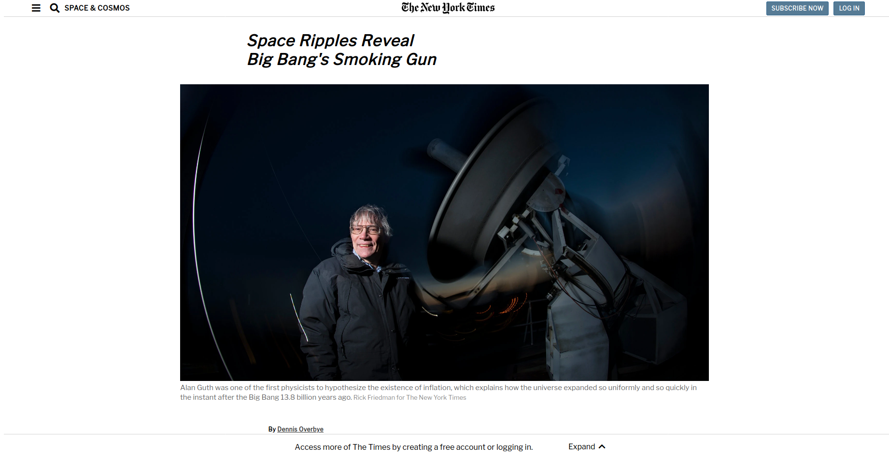

# New York Times Clone Page

> Third project in the HTML/CSS module.

This is a microverse HTML/CSS project we were required to do exercising the use of Float | Grid | Flex. It tests the positioning and floating of elements on a page. We managed to create a clone of the New York Times article page - Link to the original page is right here [NYT article](https://www.nytimes.com/2014/03/18/science/space/detection-of-waves-in-space-buttresses-landmark-theory-of-big-bang.html?_r=0) satisfying all the requirements.

Find the live version of our project here [live version](https://raw.githack.com/tacodtripe/New-York-Times-Clone-Page/features/index.html)

**This Project is testing the use of Float | Grid | Flex and part of the “CSS3 basis” 
**Your task is to clone YouTube’s video player page. Please use web archive link: http://archive.today/Bss88 as a source page.\*

## Built With

- HTML and CSS.

## Authors

👤 Nakitto Catherine

- Github: [@Cathella](https://github.com/Cathella)
- Twitter: [@Cathella9](https://twitter.com/cathella9)
- Linkedin: [linkedin](https://www.linkedin.com/in/catherine-nakitto-51ba2a40/)

👤 Raul Figueroa

- Github: [@tacodtipe](https://github.com/tacodtripe)
- Twitter: [@raul_figueroa17](https://twitter.com/raul_figueroa17)
- Linkedin: [linkedin](https://www.linkedin.com/in/luis-raul-figueroa-soto-63411118a/)

## Getting Started

To use the project in your web page clone it by "git clone" and if there is some issues please contact us

## 🤝 Contributing

Contributions, issues and feature requests are welcome!

Feel free to check the [issues page](issues/).

## Show your support

Give a ⭐️ if you like this project, enjoy!

## Acknowledgments
- Maria Reyes [@majovanilla](https://github.com/majovanilla): Code reviewer.
